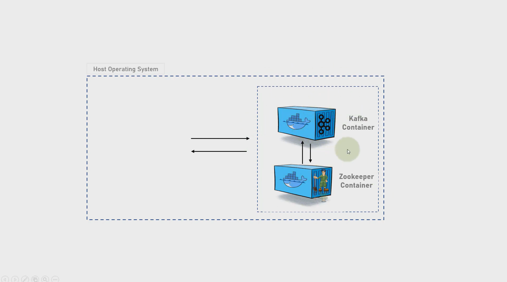

# APACHE KAFKA

 - Apache Kafka: [https://kafka.apache.org/](https://kafka.apache.org/)
 - Source: [https://github.com/thecyberbaby/Kafka](https://github.com/thecyberbaby/Kafka)

## Introduction

`Apache Kafka` is a framework implementation of a software bus using `stream-processing`. It is an open-source software platform developed by the Apache Software Foundation written in Scala and Java. The project aims to provide a unified, high-throughput, low-latency platform for handling real-time data feeds.

### Apache Kafka

Apache Kafka is an open-source distributed event streaming platform used by thousands of companies for high-performance data pipelines, streaming analytics, data integration, and mission-critical applications.

### Getting Started Guide

[Download](https://mirrors.estointernet.in/apache/kafka/2.8.0/kafka_2.13-2.8.0.tgz) the latest Kafka release and extract it :

     tar -xzf kafka_2.13-2.8.0.tgz
     cd kafka_2.13-2.8.0

### Installation using docker

 prerequisite:  
  - [Docker](https://docs.docker.com/engine/install/) must be install on your machine.
  - [Docker-compose](https://docs.docker.com/compose/install/) also must be installed on your machine .

You can also check the installed versions by :

    docker --version
    docker-compose --version

create a new directory kafka-docker :

    cd Desktop
    mkdir kafka-docker

you can download the docker-compose.yml file from above code. [link](https://github.com/thecyberbaby/Kafka).

Now, diagram can be well explained the docker-compose file 

    

### Starting the service

using docker-compose file:

    docker-compose -f docker-compose.yml up -d
    //output will be
    starting zookeeper              ...done
    starting kafka-installation     ...done

we can also verify the docker containers are up and running :

    docker-compose ps
    or
    docker ps

### Entering into the service

using conatiner id :

    docker exec -it <conatiner-id> /bin/sh

by this you should be in the kafka container service

Now, you we'll create some topics and list them. So, let's get started..

